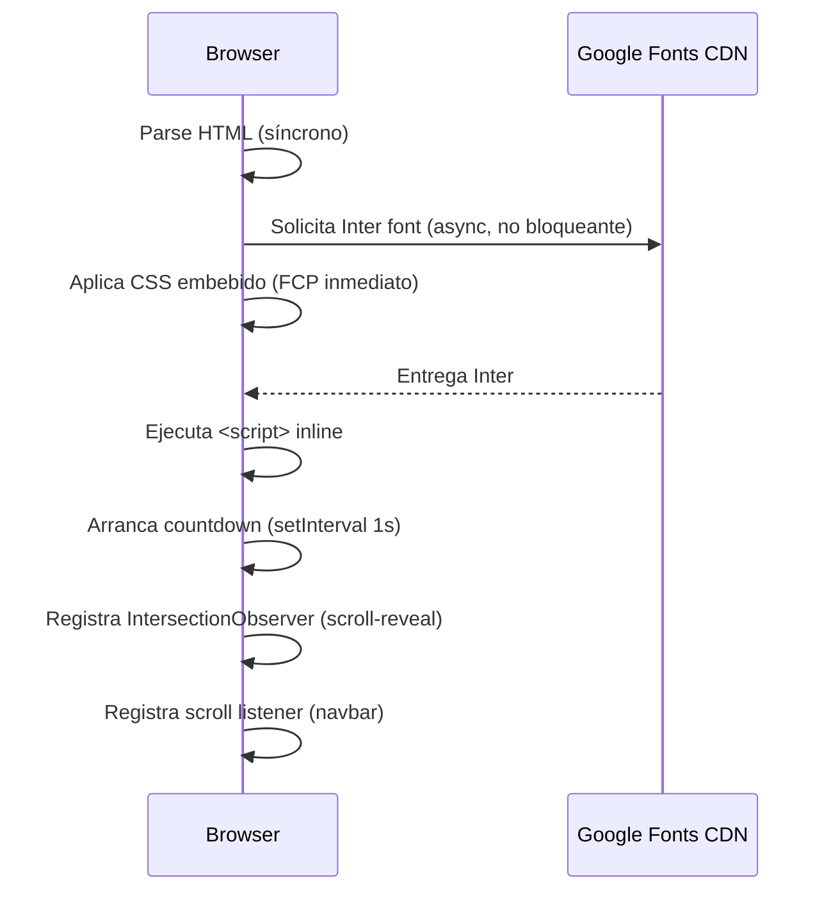

# Design Document — kiro-constructor-landing

## Overview

La landing page **"Kiro en modo constructor: specs, agentes y una web real"** es un documento web estático de una sola pantalla (`index.html`) que concentra toda la información del evento: título, fecha, hora, lugar, agenda completa, perfil de los ponentes y reconocimiento de los organizadores.

El objetivo técnico es entregar una experiencia visual de alta calidad sin depender de frameworks, bundlers ni servidores dinámicos. Todo el código (HTML, CSS, JavaScript) reside en un único archivo `index.html` que puede abrirse directamente en el navegador o servirse desde cualquier CDN / bucket de almacenamiento estático.

**Datos clave del evento**
| Campo | Valor |
|---|---|
| Nombre | Kiro en modo constructor: specs, agentes y una web real |
| Fecha | 12 de septiembre de 2026 |
| Horario | 9:00 a.m. – 11:00 a.m. |
| Lugar | UNAB, salón L51, Bucaramanga, Colombia |

**Paleta de colores**
| Token | Valor |
|---|---|
| `--color-brand` | `#FF9900` (naranja AWS) |
| `--color-bg-dark` | `#0d0d0d` |
| `--color-bg-section` | `#111827` |
| `--color-text` | `#ffffff` |

---

## Architecture

### Principio de diseño

La arquitectura es **cero-dependencias**: no hay proceso de compilación, no hay módulos npm, no hay importaciones dinámicas de terceros críticos más allá de Google Fonts. Esto maximiza la portabilidad y la velocidad de despliegue.

### Estructura de archivo único

```
index.html
├── <head>
│   ├── Meta tags (charset, viewport, description, OG)
│   ├── Google Fonts (Inter – preconnect + stylesheet)
│   └── <style> ... </style>   ← todo el CSS embebido
├── <body>
│   ├── <nav>              Navbar fija
│   ├── <main>
│   │   ├── <section id="hero">
│   │   ├── <section id="stats">
│   │   ├── <section id="agenda">
│   │   ├── <section id="ponentes">
│   │   └── <section id="organizadores">
│   └── <footer>
└── <script> ... </script>   ← todo el JS embebido
```

### Flujo de carga y renderizado



### Capas funcionales

| Capa | Tecnología | Responsabilidad |
|---|---|---|
| Estructura | HTML5 semántico | Jerarquía de contenido y accesibilidad |
| Presentación | CSS3 (variables, flex, grid, media queries) | Layout, tipografía, temas, responsive |
| Comportamiento | JavaScript vanilla | Countdown, scroll-reveal, navbar dinámica |
| Tipografía | Google Fonts – Inter | Fuente consistente en todos los breakpoints |

### Breakpoints responsivos

```
≤ 767 px  → móvil    (tarjetas en 1 columna, fuente agenda ≥ 16 px)
768–1023 px → tablet (1 o 2 columnas según espacio disponible)
≥ 1024 px → escritorio (tarjetas en 2 columnas, hero full-viewport)
```

---

## Components and Interfaces

### 1. Navbar (`<nav id="navbar">`)

**Responsabilidades**
- Mostrar el logo/nombre abreviado del evento.
- Proveer enlaces de navegación interna hacia `#hero`, `#agenda`, `#ponentes`, `#organizadores`.
- Cambiar de `background: transparent` a `background: var(--color-bg-dark)` cuando `window.scrollY > 80` mediante clase CSS `.navbar--scrolled`.

**Interfaz JS**
```js
// Invocado en DOMContentLoaded
function initNavbar() {
  const nav = document.getElementById('navbar');
  window.addEventListener('scroll', () => {
    nav.classList.toggle('navbar--scrolled', window.scrollY > 80);
  }, { passive: true });
}
```

**Atributos de accesibilidad**
- `role="navigation"`, `aria-label="Navegación principal"`.
- Cada `<a>` tiene texto descriptivo visible.
- Focus visible mediante `:focus-visible` con contorno naranja.

---

### 2. Hero (`<section id="hero">`)

**Responsabilidades**
- Ocupar al menos el 100 % del viewport height en escritorio (`min-height: 100vh`).
- Mostrar: título H1, fecha, horario, lugar, countdown en tiempo real, botón CTA.
- Renderizar toda la información sin scroll en resoluciones ≥ 320 px.

**Countdown**
```js
function initCountdown() {
  const TARGET = new Date('2026-09-12T09:00:00-05:00'); // UTC-5 Bogotá
  const els = {
    days:    document.getElementById('cd-days'),
    hours:   document.getElementById('cd-hours'),
    minutes: document.getElementById('cd-minutes'),
    seconds: document.getElementById('cd-seconds'),
  };
  const tick = () => {
    const diff = TARGET - Date.now();
    if (diff <= 0) { /* mostrar "¡El evento ha comenzado!" */ return; }
    els.days.textContent    = String(Math.floor(diff / 86400000)).padStart(2, '0');
    els.hours.textContent   = String(Math.floor((diff % 86400000) / 3600000)).padStart(2, '0');
    els.minutes.textContent = String(Math.floor((diff % 3600000) / 60000)).padStart(2, '0');
    els.seconds.textContent = String(Math.floor((diff % 60000) / 1000)).padStart(2, '0');
  };
  tick();
  return setInterval(tick, 1000);
}
```

**Estructura HTML**
```html
<section id="hero" aria-labelledby="hero-title">
  <h1 id="hero-title">Kiro en modo constructor:
    <span>specs, agentes y una web real</span></h1>
  <p class="hero__meta">
    <time datetime="2026-09-12">12 de septiembre de 2026</time>
    · 9:00 a.m. – 11:00 a.m.
    · UNAB, salón L51
  </p>
  <div class="countdown" aria-label="Cuenta regresiva al evento">
    <div class="countdown__unit"><span id="cd-days">--</span><small>días</small></div>
    <div class="countdown__unit"><span id="cd-hours">--</span><small>horas</small></div>
    <div class="countdown__unit"><span id="cd-minutes">--</span><small>min</small></div>
    <div class="countdown__unit"><span id="cd-seconds">--</span><small>seg</small></div>
  </div>
  <a href="#agenda" class="btn btn--primary">Ver agenda</a>
</section>
```

---

### 3. Stats Bar (`<section id="stats">`)

**Responsabilidades**
- Mostrar 3–4 cifras rápidas del evento (p. ej. "2 ponentes", "8 bloques", "2 horas", "1 workshop").
- Sin interactividad; puramente presentacional.
- Layout: `display: flex; flex-wrap: wrap; justify-content: center;` con tarjetas de igual tamaño.

---

### 4. Agenda (`<section id="agenda">`)

**Responsabilidades**
- Renderizar exactamente 8 `AgendaBlock` en orden cronológico ascendente.
- Cada bloque muestra: rango horario, badge de tipo, título de la actividad y, cuando aplica, nombre del ponente.
- Bloques sin ponente **no** muestran campo vacío ni placeholder.
- En móvil (≤ 767 px): columna única, fuente mínima 16 px.

**Fuente de datos (objeto JS inline)**
```js
const AGENDA = [
  { start: '9:00',  end: '9:10',  type: 'apertura',  title: 'Observar: fundamentos de programación y panorama de SDD, KDD y Vibe Coding', speaker: null },
  { start: '9:10',  end: '9:26',  type: 'practica',  title: 'Practicar: requisitos y anatomía de SDD y KDD', speaker: null },
  { start: '9:26',  end: '9:46',  type: 'charla',    title: "Charla invitada: 'Tendencia: Vibecoding'", speaker: 'José Verbel' },
  { start: '9:46',  end: '9:56',  type: 'demo',      title: 'Crear: ejemplos comparativos en vivo', speaker: null },
  { start: '9:56',  end: '10:00', type: 'reflexion', title: 'Reflexionar: cierre y discusión', speaker: null },
  { start: '10:00', end: '10:15', type: 'refrigerio',title: 'Refrigerio', speaker: null },
  { start: '10:15', end: '10:55', type: 'workshop',  title: "Workshop práctico 'Kiro Express': construir Flappy Kiro", speaker: null },
  { start: '10:55', end: '11:00', type: 'cierre',    title: 'Cierre', speaker: null },
];
```

**Función de renderizado**
```js
function renderAgenda(blocks) {
  const list = document.getElementById('agenda-list');
  list.innerHTML = blocks.map(b => `
    <li class="agenda-block agenda-block--${b.type}" data-start="${b.start}">
      <span class="agenda-block__time">${b.start}–${b.end}</span>
      <span class="agenda-block__badge">${b.type}</span>
      <div class="agenda-block__body">
        <p class="agenda-block__title">${b.title}</p>
        ${b.speaker ? `<p class="agenda-block__speaker">
          <svg aria-hidden="true"><!-- icono usuario --></svg>
          ${b.speaker}
        </p>` : ''}
      </div>
    </li>
  `).join('');
}
```

> **Decisión de diseño**: el renderizado se hace con JS inline para mantener la única fuente de verdad (el array `AGENDA`) y evitar duplicación entre JS y HTML. Si JS está desactivado, el contenido no se muestra; se considera aceptable dado que la audiencia objetivo es desarrolladores.

---

### 5. Ponentes (`<section id="ponentes">`)

**Responsabilidades**
- Mostrar exactamente 2 `SpeakerCard` con dimensiones de contenedor idénticas.
- Cada tarjeta incluye: nombre (H3), cargo/rol y título de la charla.
- Layout desktop: `grid-template-columns: 1fr 1fr`.
- Layout móvil: `grid-template-columns: 1fr`.

**Fuente de datos**
```js
const SPEAKERS = [
  {
    name:  'Juliana Ramirez A.',
    role:  'Semi Senior Dev FinTech y Líder de AWS User Group Bucaramanga',
    talk:  'Kiro en modo constructor: specs, agentes y una web real',
  },
  {
    name:  'José Verbel',
    role:  'Ponente invitado',
    talk:  "Tendencia: Vibecoding",
  },
];
```

**Estructura HTML generada**
```html
<article class="speaker-card">
  <h3 class="speaker-card__name">Juliana Ramirez A.</h3>
  <p  class="speaker-card__role">Semi Senior Dev FinTech …</p>
  <p  class="speaker-card__talk">Kiro en modo constructor…</p>
</article>
```

---

### 6. Organizadores (`<section id="organizadores">`)

**Responsabilidades**
- Listar los tres organizadores simultáneamente visibles sin interacción.
- Texto legible: fuente ≥ 12 px, contraste ≥ 4.5:1.

**Datos**
```js
const ORGANIZERS = ['BucaraTec', 'AWS User Group Bucaramanga', 'UNAB TEC'];
```

---

### 7. Footer (`<footer>`)

**Responsabilidades**
- Indicar año y créditos del evento.
- Aparecer al final del contenido de la página.

---

### 8. Scroll-Reveal (`IntersectionObserver`)

```js
function initScrollReveal() {
  const observer = new IntersectionObserver(entries => {
    entries.forEach(e => {
      if (e.isIntersecting) {
        e.target.classList.add('revealed');
        observer.unobserve(e.target);
      }
    });
  }, { threshold: 0.15 });

  document.querySelectorAll('[data-reveal]').forEach(el => observer.observe(el));
}
```

Los elementos con atributo `data-reveal` parten de `opacity: 0; transform: translateY(24px)` y transicionan a su posición final al entrar en el viewport.

---

## Data Models

### EventData (objeto de configuración global)

```js
const EVENT = {
  title:    'Kiro en modo constructor: specs, agentes y una web real',
  date:     '2026-09-12',         // ISO 8601
  dateLabel:'12 de septiembre de 2026',
  startTime:'9:00 a.m.',
  endTime:  '11:00 a.m.',
  venue:    'UNAB, salón L51',
  city:     'Bucaramanga, Colombia',
  targetISO:'2026-09-12T09:00:00-05:00', // para el countdown
};
```

### AgendaBlock

| Propiedad | Tipo | Descripción |
|---|---|---|
| `start` | `string` | Hora de inicio en formato HH:MM |
| `end` | `string` | Hora de fin en formato HH:MM |
| `type` | `string` | Badge de tipo: `apertura`, `practica`, `charla`, `demo`, `reflexion`, `refrigerio`, `workshop`, `cierre` |
| `title` | `string` | Descripción de la actividad |
| `speaker` | `string \| null` | Nombre del ponente; `null` si no aplica |

### SpeakerCard

| Propiedad | Tipo | Descripción |
|---|---|---|
| `name` | `string` | Nombre completo del ponente |
| `role` | `string` | Cargo o rol |
| `talk` | `string` | Título de la charla |

### CountdownState

| Propiedad | Tipo | Descripción |
|---|---|---|
| `days` | `number` | Días restantes |
| `hours` | `number` | Horas restantes dentro del día |
| `minutes` | `number` | Minutos restantes dentro de la hora |
| `seconds` | `number` | Segundos restantes dentro del minuto |

### ColorToken

```css
:root {
  --color-brand:      #FF9900;
  --color-bg-dark:    #0d0d0d;
  --color-bg-section: #111827;
  --color-text:       #ffffff;
  --color-text-muted: #9ca3af;
  --font-base:        'Inter', sans-serif;
  --transition-base:  0.3s ease;
}
```

---

## Correctness Properties

*Una propiedad es una característica o comportamiento que debe ser verdadera en todas las ejecuciones válidas del sistema — esencialmente, un enunciado formal sobre lo que el sistema debe hacer. Las propiedades sirven como puente entre especificaciones legibles por humanos y garantías de corrección verificables por máquina.*

---

### Property 1: Agenda completa, en orden cronológico y con campos requeridos

*Para cualquier* array de `AgendaBlock` de longitud N ≥ 1 donde cada bloque tiene `start`, `end` y `title` definidos y no vacíos, `renderAgenda(blocks)` SHALL producir exactamente N elementos `.agenda-block` en el DOM; los atributos `data-start` de esos elementos SHALL estar en el mismo orden que el array de entrada; y cada elemento SHALL contener texto visible correspondiente a `start`, `end` y `title` del bloque correspondiente.

**Validates: Requirements 2.1, 2.10, 2.11**

---

### Property 2: Ausencia de campos vacíos de ponente / diferenciación visual

*Para cualquier* array de `AgendaBlock` con mezcla arbitraria de bloques con `speaker != null` y bloques con `speaker == null`, el HTML producido por `renderAgenda` SHALL cumplir: cada bloque con `speaker != null` contiene un elemento `.agenda-block__speaker` con texto no vacío, y cada bloque con `speaker == null` NO contiene ningún elemento `.agenda-block__speaker` ni texto vacío, placeholder ni guion en ese espacio.

**Validates: Requirements 3.2, 3.3**

---

### Property 3: Dimensiones homogéneas de tarjetas de ponente

*Para cualquier* ancho de viewport entre 320 px y 1920 px, las dos tarjetas de ponente presentes en `#ponentes` SHALL tener `offsetWidth` y `offsetHeight` iguales (tolerancia: ±1 px), y el nivel de encabezado HTML del nombre del ponente SHALL ser el mismo en ambas tarjetas.

**Validates: Requirements 4.4**

---

### Property 4: Hero visible sin scroll en el viewport inicial

*Para cualquier* combinación de ancho de viewport entre 320 px y 4096 px y altura entre 568 px y 1440 px, en el instante inmediatamente posterior al evento `DOMContentLoaded` sin scroll previo, `document.getElementById('hero').getBoundingClientRect().bottom` SHALL ser ≤ `window.innerHeight`.

**Validates: Requirements 1.5**

---

### Property 5: Sin desbordamiento horizontal en todos los breakpoints

*Para cualquier* ancho de viewport entre 320 px y 1920 px con todas las secciones de la página presentes en el DOM, `document.documentElement.scrollWidth` SHALL ser igual a `window.innerWidth`, es decir, no debe existir desbordamiento horizontal.

**Validates: Requirements 2.13, 6.1, 6.2, 6.6**

---

### Property 6: Contraste de texto/fondo ≥ WCAG AA

*Para cualquier* par (color de texto, color de fondo) definido en la paleta de la página — incluyendo `#ffffff` sobre `#0d0d0d`, `#ffffff` sobre `#111827`, `#FF9900` sobre `#0d0d0d`, y `#FF9900` sobre `#111827` — la relación de contraste calculada con la fórmula de luminancia relativa WCAG 2.1 SHALL ser ≥ 4.5:1 para texto normal (< 18 pt / 14 pt negrita) y ≥ 3:1 para texto grande (≥ 18 pt ó ≥ 14 pt negrita).

**Validates: Requirements 5.2, 5.3, 5.4, 7.2**

---

### Property 7: Layout responsivo de tarjetas de ponente según breakpoint

*Para cualquier* viewport con ancho ≤ 767 px (móvil), el contenedor de tarjetas de ponente SHALL presentar una sola columna (las tarjetas apiladas verticalmente). *Para cualquier* viewport con ancho ≥ 1024 px (escritorio), el contenedor SHALL presentar dos columnas por defecto.

**Validates: Requirements 6.3, 6.5**

---

### Property 8: Fuente mínima 16 px en bloques de agenda en móvil

*Para cualquier* viewport con ancho ≤ 767 px, el `font-size` computado (via `getComputedStyle`) de los elementos `.agenda-block__title` SHALL ser ≥ 16 px, sin que el Visitante necesite aplicar zoom.

**Validates: Requirements 6.4**

---

### Property 9: Nombre accesible en todos los elementos interactivos

*Para cualquier* elemento `<a>` o `<button>` presente en el DOM de la página, ese elemento SHALL tener un nombre accesible no vacío (ya sea por texto visible, `aria-label` o `aria-labelledby`) y SHALL ser alcanzable y activable mediante teclado (Tab + Enter/Space).

**Validates: Requirements 7.5**

---

## Error Handling

### 1. Datos del evento no disponibles (Req. 1.8)

Si los valores de `EVENT.title`, `EVENT.dateLabel`, `EVENT.startTime` o `EVENT.venue` son cadenas vacías o `undefined` al momento de inicializar la página, JavaScript deberá:

1. Ocultar la sección `#hero` (`display: none`).
2. Inyectar un `<div role="alert" class="error-banner">` visible en la parte superior de `<main>` con el mensaje: *"La información del evento no está disponible en este momento."*

```js
function validateEventData(event) {
  const required = ['title', 'dateLabel', 'startTime', 'endTime', 'venue'];
  return required.every(k => event[k] && event[k].trim() !== '');
}

document.addEventListener('DOMContentLoaded', () => {
  if (!validateEventData(EVENT)) {
    document.getElementById('hero').style.display = 'none';
    const banner = document.createElement('div');
    banner.setAttribute('role', 'alert');
    banner.className = 'error-banner';
    banner.textContent = 'La información del evento no está disponible en este momento.';
    document.querySelector('main').prepend(banner);
    return; // detener el resto de la inicialización
  }
  // inicialización normal…
});
```

### 2. Agenda no renderizable (Req. 2.12)

Si `renderAgenda` lanza una excepción (p. ej. `AGENDA` no es un array) o produce 0 ítems, se mostrará un mensaje de error localizado dentro de `#agenda` sin afectar el resto de la página:

```js
try {
  if (!Array.isArray(AGENDA) || AGENDA.length === 0) throw new Error('AGENDA vacía');
  renderAgenda(AGENDA);
} catch (e) {
  document.getElementById('agenda-list').innerHTML =
    '<li class="error-item" role="alert">La agenda no está disponible en este momento.</li>';
}
```

### 3. Google Fonts no disponible

Si la CDN de Google Fonts falla, el sistema cae al font stack: `'Inter', system-ui, -apple-system, sans-serif`. El contenido sigue siendo legible; no se muestra error al usuario.

### 4. JavaScript desactivado

Las secciones de Agenda y Ponentes dependen de JS para su renderizado. Se recomienda añadir un `<noscript>` con mensaje informativo; el contenido estático del Hero (hardcodeado en HTML) permanece visible.

### 5. Countdown expirado

Cuando `TARGET - Date.now() <= 0`, el intervalo se limpia y el contador muestra el mensaje: *"¡El evento ya comenzó!"* o *"¡Gracias por asistir!"* según la diferencia de tiempo.

---

## Testing Strategy

### Enfoque dual: pruebas de ejemplo + pruebas de propiedad

| Categoría | Herramienta sugerida | Alcance |
|---|---|---|
| Unit / Example tests | Jest + jsdom | Funciones JS puras: `renderAgenda`, `validateEventData`, `initCountdown`, `renderSpeakers` |
| Property-based tests | **fast-check** (mínimo 100 iteraciones por propiedad) | Las 9 propiedades de corrección definidas en este documento |
| Visual / Snapshot | Playwright o Puppeteer | Capturas en 3 breakpoints (320, 768, 1280 px) |
| Accesibilidad | axe-core / Playwright-axe | Contraste, jerarquía de encabezados, atributos `alt`, navegación por teclado |
| Performance | Lighthouse CLI | LCP ≤ 3 s, sin errores JS de consola |

### Pruebas de propiedad (fast-check)

Cada propiedad se implementa como un test `fc.assert` con mínimo **100 iteraciones**. Etiqueta de referencia obligatoria en cada test:

```
// Feature: kiro-constructor-landing, Property N: <texto corto de la propiedad>
```

**Property 1 — Agenda completa, en orden y con campos requeridos**
```js
// Feature: kiro-constructor-landing, Property 1: Agenda completa, en orden y con campos requeridos
test('renderAgenda produce N bloques en orden con campos visibles', () => {
  const blockArb = fc.record({
    start:   fc.stringMatching(/^\d{1,2}:\d{2}$/),
    end:     fc.stringMatching(/^\d{1,2}:\d{2}$/),
    type:    fc.constantFrom('apertura','practica','charla','demo','reflexion','refrigerio','workshop','cierre'),
    title:   fc.string({ minLength: 1, maxLength: 100 }),
    speaker: fc.option(fc.string({ minLength: 1 }), { nil: null }),
  });
  fc.assert(
    fc.property(fc.array(blockArb, { minLength: 1, maxLength: 20 }), (blocks) => {
      renderAgenda(blocks);
      const items = [...document.querySelectorAll('#agenda-list .agenda-block')];
      expect(items).toHaveLength(blocks.length);
      items.forEach((el, i) => {
        expect(el.dataset.start).toBe(blocks[i].start);
        expect(el.textContent).toContain(blocks[i].start);
        expect(el.textContent).toContain(blocks[i].end);
        expect(el.textContent).toContain(blocks[i].title);
      });
    }),
    { numRuns: 100 }
  );
});
```

**Property 2 — Ausencia de campos vacíos de ponente / diferenciación visual**
```js
// Feature: kiro-constructor-landing, Property 2: Ausencia de campos vacíos de ponente
test('bloques con speaker tienen .agenda-block__speaker; sin speaker no lo tienen', () => {
  const blockArb = fc.record({
    start: fc.constant('9:00'), end: fc.constant('9:10'),
    type:  fc.constant('apertura'),
    title: fc.string({ minLength: 1 }),
    speaker: fc.option(fc.string({ minLength: 1 }), { nil: null }),
  });
  fc.assert(
    fc.property(fc.array(blockArb, { minLength: 1, maxLength: 15 }), (blocks) => {
      renderAgenda(blocks);
      const items = [...document.querySelectorAll('#agenda-list .agenda-block')];
      blocks.forEach((b, i) => {
        const speakerEl = items[i].querySelector('.agenda-block__speaker');
        if (b.speaker === null) {
          expect(speakerEl).toBeNull();
        } else {
          expect(speakerEl).not.toBeNull();
          expect(speakerEl.textContent.trim()).not.toBe('');
        }
      });
    }),
    { numRuns: 100 }
  );
});
```

**Property 5 — Sin desbordamiento horizontal**
```js
// Feature: kiro-constructor-landing, Property 5: Sin desbordamiento horizontal en todos los breakpoints
test('scrollWidth === innerWidth en cualquier viewport entre 320 y 1920 px', () => {
  fc.assert(
    fc.property(fc.integer({ min: 320, max: 1920 }), (width) => {
      // Requiere Playwright / browser headless para cambiar viewport
      // En jsdom: verificar que ningún elemento tiene offsetWidth > width
      document.documentElement.style.width = `${width}px`;
      const overflow = [...document.querySelectorAll('*')].some(
        el => el.scrollWidth > width + 1
      );
      expect(overflow).toBe(false);
    }),
    { numRuns: 100 }
  );
});
```

**Property 6 — Contraste WCAG AA**
```js
// Feature: kiro-constructor-landing, Property 6: Contraste de texto/fondo >= WCAG AA
test('todos los pares de colores de la paleta cumplen contraste WCAG AA', () => {
  const pairs = [
    { fg: '#ffffff', bg: '#0d0d0d',  type: 'normal' },
    { fg: '#ffffff', bg: '#111827',  type: 'normal' },
    { fg: '#FF9900', bg: '#0d0d0d',  type: 'large'  },
    { fg: '#FF9900', bg: '#111827',  type: 'large'  },
    { fg: '#9ca3af', bg: '#111827',  type: 'normal' },
  ];
  fc.assert(
    fc.property(fc.constantFrom(...pairs), ({ fg, bg, type }) => {
      const ratio = computeContrastRatio(fg, bg); // función utilitaria
      if (type === 'normal') expect(ratio).toBeGreaterThanOrEqual(4.5);
      else expect(ratio).toBeGreaterThanOrEqual(3.0);
    }),
    { numRuns: 100 }
  );
});
```

**Property 9 — Nombre accesible en elementos interactivos**
```js
// Feature: kiro-constructor-landing, Property 9: Nombre accesible en todos los elementos interactivos
test('todos los <a> y <button> tienen nombre accesible no vacío', () => {
  fc.assert(
    fc.property(fc.constant(null), () => {
      const interactives = [...document.querySelectorAll('a, button')];
      interactives.forEach(el => {
        const name = el.getAttribute('aria-label')
          || el.getAttribute('aria-labelledby')
          || el.textContent.trim();
        expect(name).not.toBe('');
      });
    }),
    { numRuns: 100 }
  );
});
```

> Las Properties 3, 4, 7 y 8 requieren un entorno de browser real (Playwright) para medir `offsetWidth`, `getBoundingClientRect` y `getComputedStyle` con precisión; se implementan con `page.evaluate()` iterando sobre viewports generados aleatoriamente con fast-check.

---

### Pruebas de ejemplo (Jest + jsdom)

| Test | Descripción | Req. |
|---|---|---|
| `validateEventData` → `true` con datos completos | Smoke del objeto `EVENT` | 1.1–1.4 |
| `validateEventData` → `false` con cualquier campo vacío | Comportamiento de error | 1.8 |
| El Hero contiene exactamente un H1 con el texto del título | Jerarquía semántica y contenido | 1.1, 7.1 |
| El Hero contiene la fecha, horario y lugar del evento | Datos obligatorios del Hero | 1.2–1.4 |
| El pie de página muestra los 3 organizadores | Verificación de contenido | 5.1 |
| El countdown muestra `--` antes de inicializar | Estado inicial | — |
| `initNavbar` agrega `.navbar--scrolled` al hacer scroll > 80 px | Comportamiento dinámico | — |
| `renderAgenda(AGENDA)` produce exactamente 8 ítems | Conteo fijo de la agenda real | 2.1 |
| La agenda incluye el bloque de Vibecoding con "José Verbel" | Dato específico de ponente | 3.1 |
| La sección de Ponentes tiene exactamente 2 tarjetas | Conteo de tarjetas | 4.1 |
| Tarjeta de Juliana Ramirez A. contiene nombre, cargo y charla | Datos de ponente | 4.2 |
| Tarjeta de José Verbel contiene nombre, cargo y charla | Datos de ponente | 4.3 |
| La página tiene exactamente 1 elemento H1 | Accesibilidad semántica | 7.1 |
| Si `AGENDA` es inválido, se muestra mensaje de error en `#agenda` | Manejo de error | 2.12 |

---

### Pruebas visuales (Playwright)

- Captura de pantalla en viewports: 320 × 568, 768 × 1024, 1280 × 800 px.
- Verificar `scrollWidth === innerWidth` (Property 5) en los tres breakpoints.
- Verificar que el Hero ocupa al menos el alto completo del viewport al cargar (Property 4).
- Verificar grid de ponentes: 1 columna en móvil, 2 columnas en escritorio (Property 7).

### Pruebas de accesibilidad (axe-core)

- Ejecutar `axe.run()` sobre el DOM completo; esperar 0 violaciones de nivel A y AA.
- Verificar manualmente: navegación completa con Tab/Enter, lectura con NVDA o VoiceOver.
- Contraste verificado automáticamente por axe + manualmente con la herramienta de contraste de Chrome DevTools.

### Performance (Lighthouse)

- LCP (Largest Contentful Paint): ≤ 3 segundos en conexión simulada de 25 Mbps.
- Sin errores en consola de JS.
- Score de accesibilidad Lighthouse ≥ 90.
- Verificación en Chrome, Firefox, Edge y Safari (dos versiones estables más recientes).
